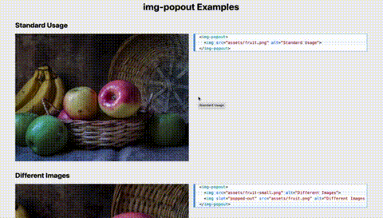

# img-popout

`img-popout` is a web component for letting users zoom in on a small image to see more details! Clicking on the image gives the user a full-screen view, somewhat modal-style.

**Live Demo**: https://auroratide.github.io/img-popout

This is the parent repository holding both the code for the actual `img-popout` component and some examples.

* Go to the **[lib folder](lib)** for more details, including how to install and use the component!
* Go to the **[examples](examples)** for tested use cases!
