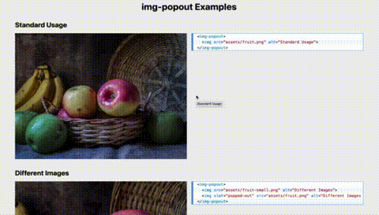

# img-popout

[](https://www.npmjs.com/package/@auroratide/img-popout)

`img-popout` is a web component for letting users zoom in on a small image to see more details! Clicking on the image gives the user a full-screen view, somewhat modal-style.

**Live Demo**: https://auroratide.github.io/img-popout



## Installation

### CDN

```html
<script defer src="https://unpkg.com/@auroratide/img-popout@0/dist/index.js"></script>
```

### NPM

```
npm install @auroratide/img-popout
```

And in your unbundled code, make sure to import the following:

```js
import '@auroratide/img-popout'
```

## Usage

```html

    
</img-popout>
```

That's basically it!

**But what if I want the popped-out image to be different?**

There's good reason to do this. Perhaps you want a small version to show the user first, and only show the larger, detailed version when desired. In this case, you can use a slot:

```html

    
    
</img-popout>
```

## Styling

| Variable | Description | Default |
| -------- | ----------- | ------- |
| `--img-popout_bg` | Background for the image when it pops out | `rgba(0, 0, 0, 0.8)` |

## Transitions

You can change the default transitions for _all_ instances of `img-popout` by setting the following:

```javascript
ImgPopoutElement.defaultTransitions.out = myOutTransition
ImgPopoutElement.defaultTransitions.in = myInTransition
```

`ImgPopoutElement` is defined on `window`.

See the [Live Demo](https://auroratide.github.io/img-popout) for examples on how to set custom transitions.

**NOTE!** `out` is by default an in-build popout animation. It must be **non-null** if you decide to override it!

**ANOTHER NOTE!** If you do not set an `in` transition, by default it will use the reverse of the `out` transition.

### Transition Schema

A transition is a _function_ with the following signature:

```typescript
type Transition = (cover: HTMLElement, img: HTMLElement, main: HTMLElement) => {
    duration: number, // in milliseconds
    tick: (t: number, ctx: object) => void,
    easing?: (t: number) => number,
    context?: () => object,
    initialize?: (ctx: object) => void,
    finalize?: (ctx: object) => void,
}
```

The function returns an object which defines, at minimum, the `duration` of the transition and what happens on each `tick`.

#### cover, img, and main

The parameters of the function represent different `HTMLElement`s you can manipulate during the transition.

* `cover` is a div that covers the user's screen; by default it's just a black background. It contains `img`.
* `img` is the instance of the image that pops out when a user elects to view more details.
* `main` is the image on the page which the user clicks to initiate the popout

#### duration [required]

**Schema:** `number`

`duration` is how long the transition should last in milliseconds. It is **required**.

#### tick [required]

**Schema:** `(t: number, ctx: object) => void`

`tick` is a function that is called on each tick of the transition. It is **required**.

**Parameters:**

* `t` is a number between 0 and 1, representing the progress of the transition. 0 means the transition has just started, and 1 means the transition is finished. `t` = 0.5 means the transition is halfway through.
* `ctx` is a context object created by the `context` function (more below).

**Example:**

```javascript
const myTransition = (cover, img, main) => ({
    tick: (t) => {
        cover.style.opacity = t.toString()
    }
})
```

#### easing

**Schema:** `(t: number) => number`
**Default:** `(t) => t`

`easing` is a function that scales the parameter `t` of the `tick` function. By default, this parameter is _linear_, meaning the transition will happen smoothly over the course of the duration.

This can be used to create different transition timings, like easing in then out, and so forth. [Easings.net](https://easings.net/) provides a very useful list of different easing models and what functions create them.

#### context

**Schema:** `() => object`
**Default:** `() => ({})`

`context` allows you to create an object that is passed to `tick`, `initialize`, and `finalize`. It can be useful for storing values that you do not want to recalculate on every tick.

#### initialize

**Schema:** `(ctx: object) => void`
**Default:** `() => {}`

`initialize` is a function that runs right at the beginning of the transition, before the first `tick`.

#### finalize

**Schema:** `(ctx: object) => void`
**Default:** `() => {}`

`finalize` is a function that runs right at the end of the transition, after the last `tick`.

### Customizing Individual Transitions

Maybe you want different instances of `img-popout` to have different transition animations. Every `img-popout` element has a property called `transition` with two parts:

* `out` for when an image is popping out of the page
* `in` for when an image is popping back into the page

In Javascript, as long as you have access to the element, you can set its transitions.

```javascript
element.transition.out = myOutTransition
element.transition.in = myInTransition
```

These will override the `defaultTransitions` for the applied element.
